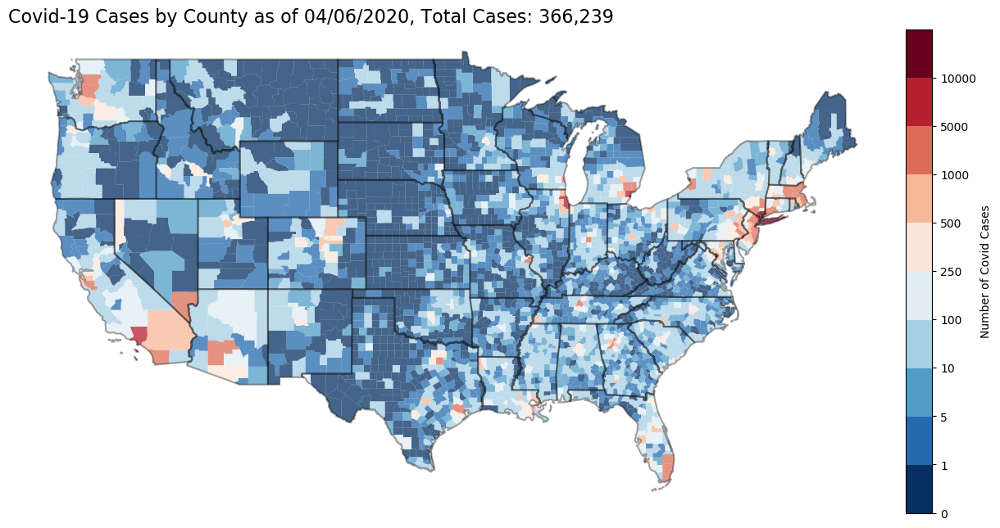

# covid-19-map

Creates a [static](covid-19-map.png) and [live/interactive html map](https://mwaugh0328.github.io/covid-19-map/us_covid_map.html) using data from [@nytimes](https://github.com/nytimes/covid-19-data) that tracks the spread of Covid-19 by date and US counties. Please see [@nytimes](https://github.com/nytimes/covid-19-data) repository for information regarding the data and it's use.

The jupyter notebook [``us-covid-19-map.ipynb``](us-covid-19-map.ipynb) downloads, basic cleaning, merges with US Census shapefiles and Census data. It then generates a static map (using GeoPandas) and then interactive plot (from Bokeh). This code largely builds on the maps generated from my research on the [US-China trade war](https://github.com/mwaugh0328/consumption_and_tradewar).

- Datafrom: Nytimes github repo [https://github.com/nytimes/covid-19-data](https://github.com/nytimes/covid-19-data) Data from The New York Times is based on reports from state and local health agencies. 

- Interactive map with hover tool here:

  [https://mwaugh0328.github.io/covid-19-map/us_covid_map.html](https://mwaugh0328.github.io/covid-19-map/us_covid_map.html)

- Currently the hover tool just reports county name, cases, deaths, and population from the US Census. More could be done here.
