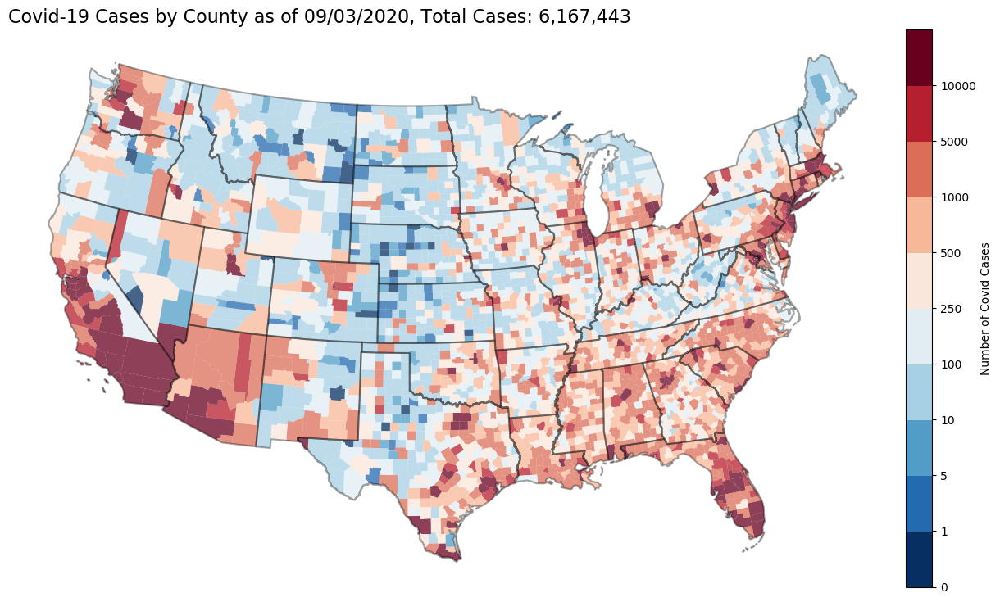

# covid-19-map
US interactive map of Covid-19 outbreak

Creates a map using data from @nytimes that tracks the spread of Covid-19. Map technology is built from my work from trade war. Data from The New York Times, based on reports from state and local health agencies.

- Datafrom: https://github.com/nytimes/covid-19-data

- Interactive map with hover tool here:

  [https://mwaugh0328.github.io/covid-19-map/us_covid_map.html](https://mwaugh0328.github.io/covid-19-map/us_covid_map.html)
